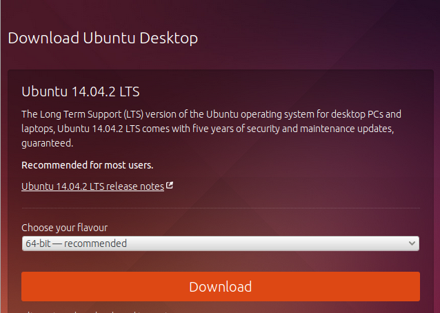

!SLIDE

# Defenestrazione #

Togliere Microsoft Windows da un computer viene chiamato "defenestrazione".
Se vuoi defenestrare il tuo computer, possiamo fissare
un secondo incontro workshop per farlo. Chi ha un computer Apple e vuol
liberarlo, lo può fare pure - manca solo il verbo scherzoso.

!SLIDE

# Prima di installare un sistema libero...

* possibili problemi:
  * driver video, wireless, stampanti
* possibile soluzione Ubuntu LTS
* I am not your help desk.

!SLIDE

# Scaricare Ubuntu

 [link](http://www.ubuntu.com/download/desktop)

!SLIDE

# Dimostrazione Installazione Ubuntu
